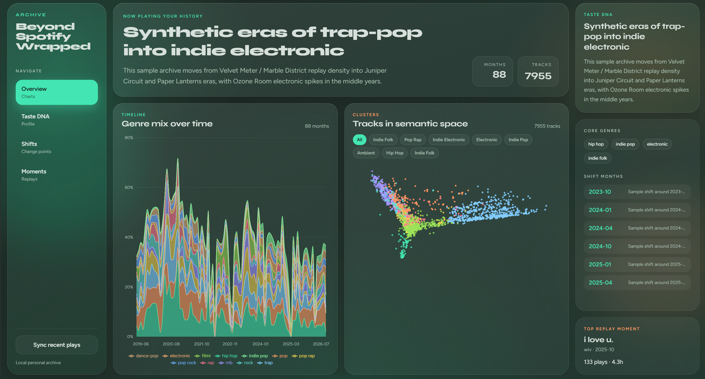
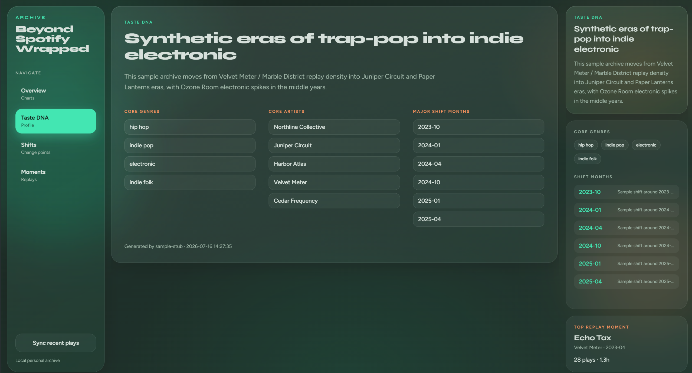
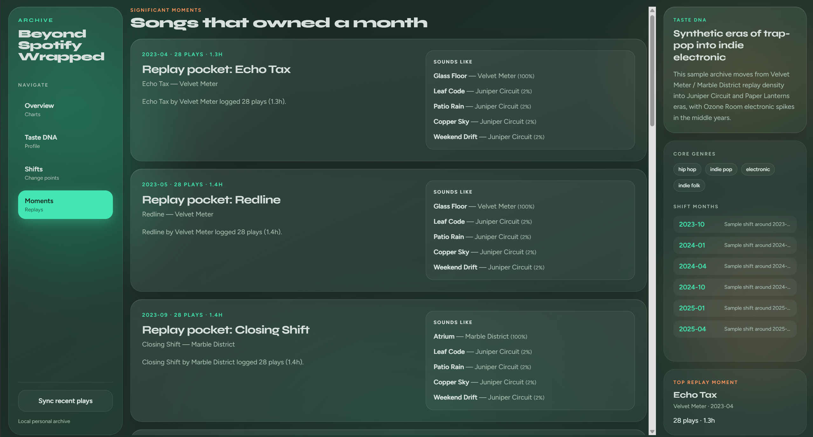

# Beyond Spotify Wrapped

A personal music-identity analytics app built on your **full Spotify listening history**—not the limited Web API window, and not Spotify’s deprecated `audio-features`.

It turns years of listens into:

- a monthly **genre-mix timeline**
- **metadata embeddings** + track **clusters**
- **change-point** detection for taste shifts
- grounded **LLM narratives** (local [Ollama](https://ollama.com), optional for the sample demo)
- a glassmorphic **React dashboard** over a **FastAPI** backend

## Why this architecture

Spotify permanently deprecated `audio-features` (energy / valence / danceability, etc.). This project substitutes **track / artist / genre metadata embeddings** and MusicBrainz tags—still useful for clustering and “sounds like,” without relying on dead endpoints.

> **Implementation note:** The original design mentioned sentence-transformers, Chroma, UMAP, and `ruptures`. The working stack uses TF‑IDF + SVD embeddings, NumPy nearest-neighbor retrieval, PCA for 2D plots, and a lightweight multivariate change detector (cleaner installs on newer Python / Windows). Behavior matches the milestone goals.

## Screenshots

Add images under [`docs/screenshots/`](docs/screenshots/) then link them here:






## How open source works (important)

This repo is meant to ship **code + anonymized sample data**, never **your** listening history or API secrets.

| Ships in git | Stays on your machine only |
|---|---|
| Python / React source | `.env`, `frontend/.env` |
| `.env.example` placeholders | `data/*.sqlite3`, embeddings, plots |
| `sample_data/` fake listens | Spotify OAuth cache (`.cache-spotify`) |
| Docs / scripts | Your real Extended Streaming History export |

**What a stranger gets when they clone**

1. They can run `python scripts/bootstrap_sample.py` and open the dashboard on **fake** music data—no Spotify account required.
2. Or they plug in **their own** Spotify app + **their own** export and rebuild analytics locally.
3. They never receive your database, tokens, or export ZIP unless you accidentally commit them.

**Before you push publicly**

1. Confirm secrets are untracked: `git status` should not list `.env`, `data/`, or `.cache-spotify`.
2. Keep `my_spotify_data/` **outside** the repo (or ensure it stays gitignored).
3. Rotate any Spotify client secret that was ever pasted into chat / screenshots.
4. Drop screenshots that don’t show emails, keys, or uniquely identifying profile chrome.

## Quick start A — sample demo (no Spotify)

```bash
git clone <your-repo-url> BeyondSpotifyWrapped
cd BeyondSpotifyWrapped

python -m venv .venv
# Windows
.\.venv\Scripts\activate
pip install -r requirements.txt

copy .env.example .env
# Set any API_KEY string (used by the local FastAPI auth header)

python scripts/bootstrap_sample.py

# terminal 1
python scripts/run_api.py

# terminal 2
cd frontend
copy .env.example .env
# Set VITE_API_KEY to the SAME value as API_KEY in the root .env
npm install
npm run dev
```

Open http://127.0.0.1:5173 — API docs at http://127.0.0.1:8000/docs.

## Quick start B — your own Spotify data

### Requirements

- Python 3.12+ (3.14 works for this stack)
- Node.js 20+
- Spotify Premium (current Development Mode apps) + a [Spotify developer app](https://developer.spotify.com/dashboard)
- Your **Extended Streaming History** from [Spotify privacy settings](https://www.spotify.com/account/privacy/)
- Optional: [Ollama](https://ollama.com) + `qwen3:8b` for real narratives

### Setup

```bash
python -m venv .venv
.\.venv\Scripts\activate
pip install -r requirements.txt
copy .env.example .env
```

Fill in:

- `SPOTIPY_CLIENT_ID` / `SPOTIPY_CLIENT_SECRET`
- `SPOTIPY_REDIRECT_URI=http://127.0.0.1:8888/callback`
- `API_KEY` (long random string)

```bash
python scripts/test_api_access.py
python scripts/init_db.py
python scripts/import_export.py path\to\your\spotify_export
python scripts/run_sync.py

python scripts/enrich_genres.py
python scripts/build_genre_mix.py
python scripts/detect_changes.py
python scripts/build_track_embeddings.py

python scripts/prepare_narratives.py
# with Ollama running:
ollama pull qwen3:8b
python scripts/generate_narratives.py

python scripts/run_api.py
# + frontend as above
```

## Architecture

```text
Spotify Extended Export ──► export parser ─┐
                                           ├──► SQLite
Spotify recently-played ──► nightly sync ──┘
         │
         ▼
 MusicBrainz genres (or sample seeds)
         │
         ├─► monthly genre mix ─► change points ─► narrative jobs
         │
         └─► TF-IDF/SVD embeddings ─► K-means + PCA
                    │
                    └─► nearest neighbors (“sounds like”)
         │
         ▼
 FastAPI (X-API-Key) ──► React dashboard
```

## Project layout

```text
BeyondSpotifyWrapped/
  src/            # DB, sync, analytics, Ollama client, FastAPI
  scripts/        # CLI entrypoints
  frontend/       # Vite + React + Tailwind dashboard
  sample_data/    # anonymized fake export for demos
  docs/           # screenshots + notes
  data/           # local only (gitignored)
```

## API

All routes except `/health` require header `X-API-Key`.

| Method | Path | Purpose |
|--------|------|---------|
| GET | `/timeline` | Monthly genre mix |
| GET | `/clusters` | Cluster labels + 2D points |
| GET | `/moments` | Replay moments + neighbors |
| GET | `/narratives` | Change-point stories |
| GET | `/taste-dna` | Profile summary |
| POST | `/sync` | Manual recently-played sync |

## Resume bullets (draft)

- Built an AI-powered music identity platform using metadata embeddings, PCA/K-means clustering, and change-point detection to generate personalized narrative insights about listening behavior over time.
- Designed a semantic retrieval layer for cross-era track similarity, and an LLM narrative pipeline (local Ollama) grounded in pre-computed statistical deltas rather than raw dumps—reducing generic “your taste evolved” output.
- Shipped a FastAPI + React analytics dashboard after redesigning around Spotify’s `audio-features` deprecation.

## License

MIT — see [LICENSE](LICENSE).
